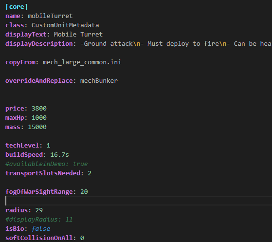

# RWModCode 


>RWModCode - это плагин Visual Studio Code упрощающий разработку модов для игры Rusted Warfare 

## Возможности

- Подсветка синтаксиса
- подсказки
- Валидация
   * Проверка обязательных полей
   * Валидация типов данных


подсветка:



## Установка

1. Откройте Extensions (Ctrl+Shift+X)
2. Найдите `RWModCode`
3. Нажмите 'Install'


## Настройки

```json
"rwmodcode.maxSuggestions": 50,
"rwmodcode.enableLinting": true
```

## Ссылки
- [Github](https://github.com/xHak2215/RWmodCode)


